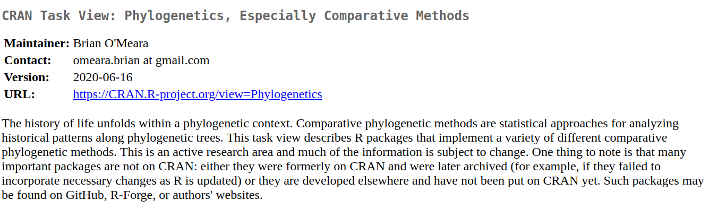

```{css, echo = FALSE}
.tiny .remark-code { /*Change made here*/
  font-size: 50% !important;
}
```

```{r setup, include=FALSE}
knitr::opts_chunk$set(echo = FALSE)
options(htmltools.dir.version = FALSE)
library(xaringanthemer)
library(knitr)
library(ggplot2)
xaringanthemer::style_mono_accent(
  base_color = "#A70000",
  #  primary_color = "#A70000",
  #secondary_color = "#ff0000",
  white_color = "white",
  colors = c(
    red = "#A70000",
    purple = "#88398a",
    orange = "#ff8811",
    green = "#136f63",
    blue = "#4B4FFF",
    white = "#FFFFFF",
    black = "#181818"
  ),
  header_font_google = google_font("Roboto Condensed"),
  text_font_google   = google_font("Roboto Condensed", "300", "300i"),
  code_font_google   = google_font("Ubuntu Mono"),
  text_font_size = "30px",
  code_font_size = "30px",
)

```

## sobre

- trabalho com modelagem estatística & ecologia de comunidades

- **.red[¡liibre!]** laboratório independente de biodiversidade e reprodutibilidade em ecologia

- pacotes [__.red[modler]__](https://model-r.github.io/modleR/]modleR) e [__.red[coronabr]__](https://liibre.github.io/coronabr/about.html)

- [**.purple[@RLadiesRio]**](https://twitter.com/RLadiesRio) 

- [**Observatório COVID-19 BR**](https://covid19br.github.io/)

```{r logos, out.width = 150, echo = FALSE}
knitr::include_graphics("https://raw.githubusercontent.com/liibre/logo/master/figures/logo_liibre.png?token=AA75IFQA34SCCZB72UL5IXK7UWDYA")
knitr::include_graphics("https://raw.githubusercontent.com/rladies/starter-kit/master/stickers/rainbow-inclusive.png")

```

---

class: middle
background-image: url("./figs/logo_jbrj.png")
background-position: 98% 2%
background-size: 100px


## disciplina _Projetos de análise de dados usando_ `r icon::fa("r-project")`

.pull-left[

```{r, out.width= 400}
knitr::include_graphics("https://raw.githubusercontent.com/liibre/Latin-R/master/slides/./figs/turma.JPG")
```


```{r, out.width= 150, fig.align = "center"}
knitr::include_graphics("https://raw.githubusercontent.com/liibre/logo/master/figures/logo_liibre.png?token=AA75IFQA34SCCZB72UL5IXK7UWDYA")
```

]

.pull-right[
__Boas práticas__ em análise de dados
(Material [aqui](https://gitlab.com/liibre/curso/-/wikis/Projetos-de-an%C3%A1lise-de-dados-usando-R))

```{r, out.width= 150}
knitr::include_graphics("https://raw.githubusercontent.com/liibre/Latin-R/master/slides/./figs/logo-git.png")
knitr::include_graphics("https://raw.githubusercontent.com/liibre/Latin-R/master/slides/./figs/GitHub_Logo.png")
knitr::include_graphics("https://raw.githubusercontent.com/liibre/Latin-R/master/slides/./figs/btibucket.png")
knitr::include_graphics("https://raw.githubusercontent.com/liibre/Latin-R/master/slides/./figs/gitlab-logo-gray-rgb.png")
```

```{r, out.width= 100}
knitr::include_graphics("https://raw.githubusercontent.com/liibre/Latin-R/master/slides/./figs/latex.jpeg")
knitr::include_graphics("https://raw.githubusercontent.com/liibre/Latin-R/master/slides/./figs/bibtex.jpeg")
knitr::include_graphics("https://raw.githubusercontent.com/liibre/Latin-R/master/slides/./figs/zotero.svg")
```
```{r, out.width= 50}
knitr::include_graphics("https://raw.githubusercontent.com/liibre/Latin-R/master/slides/./figs/rmarkdown.png")
```

]

---

## sobre hoje

1. por que usar o R?

2. como usar o R?

3. aplicações em Biodiversidade

4. outras aplicações


---
class: inverse, middle, center 

# por que usar o R?

---

## R de reprodutibilidade

.pull-left[

- um dos pilares da __ciência aberta__


- ferramenta baseada em script


- permite a reconstrução dos passos


- cultura coletiva

]

.pull-right[

```{r open-science, out.width = 1000}
knitr::include_graphics("./figs/The-six-core-principles-of-Open-Science-which-guide-the-Open-Traits-Network.png")
```

]
---

## por que R?

- projeto GNU
> think of free as in free speech, not as in free beer

--

- FLOSS: __free__, __libre__ & __open-source__ 

--

- script é essencial para reprodutibilidade, mas não a garante 


--

- acessível (em comparação a outras linguagens de programação)

--

- muito comum na Biologia, Ciência de Dados e em diversas áreas

--

- __comunidade__

--

---
## comunidade

```{r, fig.align='center'}

```


---
## ambiente para análise 

+ manipulação de dados

--

+ ampla coleção de ferramentas para análise de dados e criação de gráficos

--

+ linguagem simples e efetiva que inclui condicionais `if{}`, laços `loop{}`, funções definidas pela pessoa usuária `function()`

---

## construção de uma habilidade analítica

> Uma das coisas mais importantes que você pode fazer é dedicar um tempo para aprender uma linguagem de programação de verdade. Aprender a programar é como aprender outro idioma: exige tempo e treinamento, e não há resultados práticos imediatos. Mas se você supera essa primeira subida íngreme da curva de aprendizado, os ganhos como cientista são enormes. Programar não vai apenas livrar você da camisa de força dos pacotes estatísticos, mas também irá aguçar suas habilidades analíticas e ampliar os horizontes de modelagem ecológica e estatística.

Tradução um tanto livre de Gotelli & Ellison, 2004. A Primer of Ecological Statistics. Sunderland, Sinauer.

---

## necessidade: pacote vegan & curva de acúmulo de espécies

.pull-left[
```{r vegan, out.width = 500}

```
]

.pull-right[
```{r bci, out.width = 500}

```
]


---
class: inverse, middle, center 

# como usar o R?

---

## criando um fluxo de trabalho

- __um projeto__, __uma pergunta__, __uma__(s) __análise__(s)

--

- cada projeto uma pasta `R_ufrb_demo`

--

- cada pasta é __autocontida__

--

```
.
├── data/
├── docs/
├── figs/
├── outputs/
├── R_ufrb_demo.Rproj
├── README.md
└── scripts/
```

---
## Caminhos relativos

```{r path-scheme, out.width=900}
include_graphics("./figs/relative_path.jpg")
```


---
background-image: url(./figs/jenny_bryan.jpeg)
background-size: 220px 240px
background-position: 85% 50%

## usando projetos de RStudio
esqueça `setwd()` e conheça [Jenny Bryan](https://www.tidyverse.org/blog/2017/12/workflow-vs-script/)


---
## .Rproj define o wd

```{r proj, out.width=1030}
include_graphics("./figs/rstudio_proj.png")
```


---
## usando caminhos relativos nos scripts

```{r path-script}

```


---
## um projeto de análise

.pull-left[
- uma boa pergunta

- dados

- conectando conceitos com dados
]

.pull-right[
```{r, out.width=400}
include_graphics("./figs/theory.jpg")
```

]

---
class: middle, center

# como posso entender a distribuição de uma espécie a partir de dados de coleções?

---
class: inverse, middle, center 

# aplicações em biodiveRsidade

---
## dados de biodiversidade
### museus & herbários

.pull-left[
```{r biod1, out.width=500}

```
]

.pull-right[
```{r biod2, out.width=400}

```
]

--- 
## dados de biodiversidade
### amostragem

```{r sampling}

```


## componentes dos dados de biodiversidade

+ espécies (informação taxonômica)

--

+ atributos das espécies

--

+ localidades

--

+ ocorrências

--

+ variáveis: altura, peso, DNA... 

---

## padronização de dados em biodiversidade 
### [https://dwc.tdwg.org/](Darwin Core)

facilitar o compartilhamento da informação sobre diversidade biológica

```{r dwc, fig.align='center', out.width = 350}

```

---

## padronização de dados em biodiversidade 
### [https://dwc.tdwg.org/](Darwin Core)

```{r dwc2, out.width=700, fig.align='center'}

```


---

## como funcionam as bases de dados relacionais

+ diferentes dados são organizados em diferentes tabelas

--

+ tabelas são integradas

--

+ identificador comum para cada tabela

--

+ em geral organizadas em __SQL__ (_Structured Query Language_)

---

## Flora do Brasil 2020

```{r flora}

```

---
## GBIF

```{r gbif}

```

---
## ferramenta IPT do GBIF

```{r gbif2}

```

---
## `r include_graphics("./figs/IPT.png")`


> Brazil Flora G (2020): Brazilian Flora 2020 project - Projeto Flora do Brasil 2020. v393.262. Instituto de Pesquisas Jardim Botanico do Rio de Janeiro. Dataset/Checklist. doi:10.15468/1mtkaw

- 49.343 espécies

- 136.314 taxa

- informação sobre: distribuição, habitat, endemismo, referência ...

---

## acessando por meio do R

- pacote `rgbif`

- pacote `flora`

- [pacote `Rocc`](https://github.com/liibre/Rocc)

---
## `r include_graphics("./figs/Ropensci.png")`

> Transforming science through open data, software & reproducibility


- conjunto de pacotes para dados abertos

- equipe de bioinformática muito ativa


- bases de dados, limpeza taxonômica ... 


- pacotes `rgbif`, `taxize`, `taxview` ...


---
class: middle,  center

# `r icon::fa('r-project', size = 3)`

---
## o quanto conhecemos da espécie?
_Ziziphus joazeiro_ Mart.


```{r, fig.align='center', out.width=700}
include_graphics("https://raw.githubusercontent.com/saramortara/R_ufrb/master/figs/mapa_Ziziphus_joaezeiro.png")
```


---
## boas práticas

- organizar bem suas pastas
--


- scripts __modulares__
--


- não misturar dados brutos com dados processados!
--


- __documentação__ é essencial
--

---
## task views - Environmentrics

```{r}

```


---
## task views - Phylogenetics

```{r}

```


---
class: inverse, middle, center

# outRas aplicações

---


--- 
## pacote coronabr


```{r}

```


---
## dados, responsabilidade & contexto


- dados deveriam ser abertos e acessíveis
  
  [Trânsparência COVID-19 OPEN KNOWLEDGE BRASIL](https://transparenciacovid19.ok.org.br)
  
  
- nem toda análise que **pode** ser feita, **deve** ser feita 


- cada dado diz respeito a uma pessoa


- para COVID-19 e SRAG: **subnotificação** & **atraso**


- inconsistência com dados reportados em diferentes escalas: município, estado, país

---
## Macapá-AM


```{r}
ma <- read.csv("./data/macapa.csv")
ma$date <- as.Date(ma$date)
```

```{r, eval = FALSE, echo = TRUE}
# Script para download de dados de covid-19 no município do Rio de Janeiro

# Para instalar o pacote use:
#remotes::install_github("liibre/coronabr")

# 1. bibliotecas ####
library(coronabr)
library(ggplot2)

# 2. download ####
## dados macapa-ap usando o geocode IBGE
ma <- get_corona_br(filename = "macapa",
                    dir = "data/",
                    ibge_cod = "1600303")

```

---
## entendendo os dados

.tiny[
```{r echo = TRUE}
# 3. inspeção dos dados ####
head(ma[, c(3, 4, 9:18)])

```
]

---
## entendendo os dados

.tiny[
```{r echo = TRUE, size=.5}
tail(ma[, c(3, 4, 9:18)])
```
]

---
## criando um gráfico com [ggplot2](https://ggplot2.tidyverse.org)

```{r, echo = TRUE, eval = FALSE}
# 4. Fazendo um gráfico simples ####
ggplot(ma, aes(x = date, 
               y = last_available_confirmed_per_100k_inhabitants)) +
  geom_line(color = "red",
            alpha = .5) +
  geom_point(color = "red") +
  scale_x_date(date_labels = "%d/%b") +
  labs(x = "Data",
       y = "Casos (por 100 mil habitantes)",
       caption = paste0("Fonte: Brasil.io"),
       title = "Casos de COVID-19 em Macapá-AM") +
  theme_minimal()
```

---
## nosso gráfico


```{r, fig.align="center", fig.width = 6, fig.height  = 6}
ggplot(ma, aes(x = date, 
               y = last_available_confirmed_per_100k_inhabitants)) +
  geom_line(color = "red",
            alpha = .5) +
  geom_point(color = "red") +
  scale_x_date(date_labels = "%d/%b") +
  labs(x = "Data",
       y = "Casos (por 100 mil habitantes)",
       caption = paste0("Fonte: Brasil.io"),
       title = "Casos de COVID-19 em Macapá-AM") +
  theme_minimal()
```


---
## apagão

```{r, fig.align='center', out.width=400}
include_graphics("./figs/AP_design_ativista.png")
```

`r icon::fa("instagram")` @designativista


---
## casos não reportados


```{r, fig.align='center', out.width=600}

```

`r icon::fa("twitter")` @alcinea

---
## ressalvas em relação aos dados brutos

0.  __apagão__
--


1. __subnotificação__
--


2. __atraso__ na entrada dos dados no sistema - tanto para casos como óbitos
--

---
## como vemos o atraso

```{r gif, out.width=500, fig.align='center'}
include_graphics("https://raw.githubusercontent.com/covid19br/covid19br.github.io/master/fig/gif_BE_05_junho.gif")
```

---
## Observatório Covid-19BR

```{r, fig.align='center'}
include_graphics("./figs/observatorio.png")
```


---
## correção por nowcasting 

```{r obs-diarios, fig.align='center', out.width=700}

```


---
## comparação entre notificados e estimados 

```{r obs-acu, fig.align='center', out.width=700}
include_graphics("./figs/acumulados_AP.png")
```


---
## recursos

- [Projetos de análise de dados usando R](https://gitlab.com/liibre/curso/-/wikis/Projetos-de-an%C3%A1lise-de-dados-usando-R)

- [Data cleaning tools. ENM Course 2020](https://www.youtube.com/watch?v=266Q56M-48w&t=2424s )

- [Canal de Youtube R-Ladies+ Rio](https://www.youtube.com/channel/UCGwTYiK7vTePhPpDRgQAq_A)

- [Canal de Youtube R-Ladies+ BH](https://www.youtube.com/channel/UCtpGCWyRdscfs6KflWjACKw)

- [Jenny Bryan. Project Oriented Workflow](https://www.tidyverse.org/blog/2017/12/workflow-vs-script/)

- [Page Piccinini. Curso R - R & git setup.](https://pagepiccinini.com/r-course/lesson-0-introduction-and-set-up/)

---
## recursos

```{r, out.width=300, fig.align='center'}
include_graphics("./figs/r_data_science.jpg")
```
Disponível em: https://r4ds.had.co.nz/


